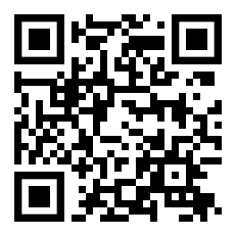

# Memory Task

A collection of working memory tasks in a set of standalone lightweight web applications

----

### Memory Task

An implementation of the "masking task" and the "limited-hold memory task" using numerals,
arrows and letters as visual stimuli

https://fson4.github.io/mt/

----

### Same or Different

Recognize change in a set of colors, shapes or symbols

https://fson4.github.io/sod/

----

### N-back Task

The n-back task using visual and aural (optional) stimuli

https://fson4.github.io/nb/

----

### Backwards Task

An implementation of a test used by ESA. Recall the sequence of numerals,
letters or colors in reverse order

https://fson4.github.io/bt/

----
